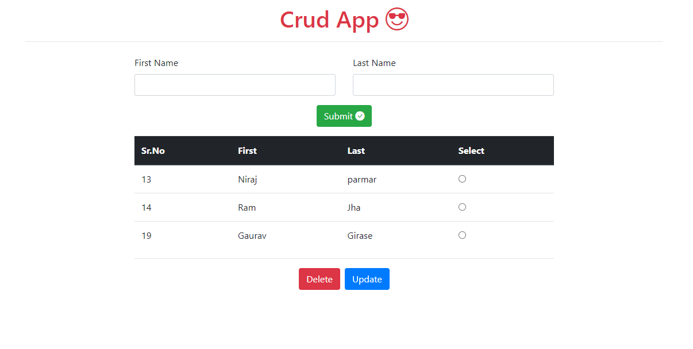

### Django CURD 
##### Follow below steps to run your localserver.
Step-1
```sh
git clone https://github.com/GauravGirase/DjangoCURD.git
```
Step-2
Create virtual env and install requirements.txt file
```sh
cd DjangoCURD
virtualenv venv
venv\Scripts\activate
pip install -r requirements.txt
```

Step-3
Runserver
```sh
python manage.py runserver
```
Done

Step-1
This is Homepage
```sh
http://127.0.0.1:8000

```
  
